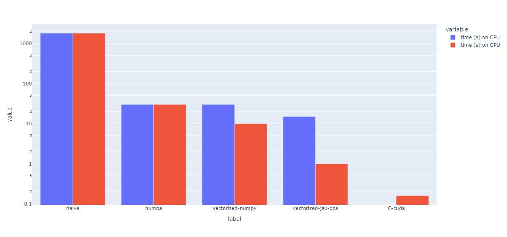

# python-optimization

Some tests to optimize a scientific python code with numba and jax on cpu and gpu.

The code sample performs ray tracing on a 1200 x 800 pixel image, throwing 50 ray per pixel.
Optimization procedure is as follows:
1) naive python implementation (triple loop, no vectorization)
2) the double loop on the pixels is optimized with Numba
3) the double loop on the pixels is vectorized with NumPy
4) NumPy operators are replaced by jax.numpy

This procedure is done both on CPU and a T4 GPU, using Google collab notebook.
On GPU only, an optimized C-Cuda implementation is also benchmarked.

I would be happy to have feedback, questions or suggestions through issues in this project.
